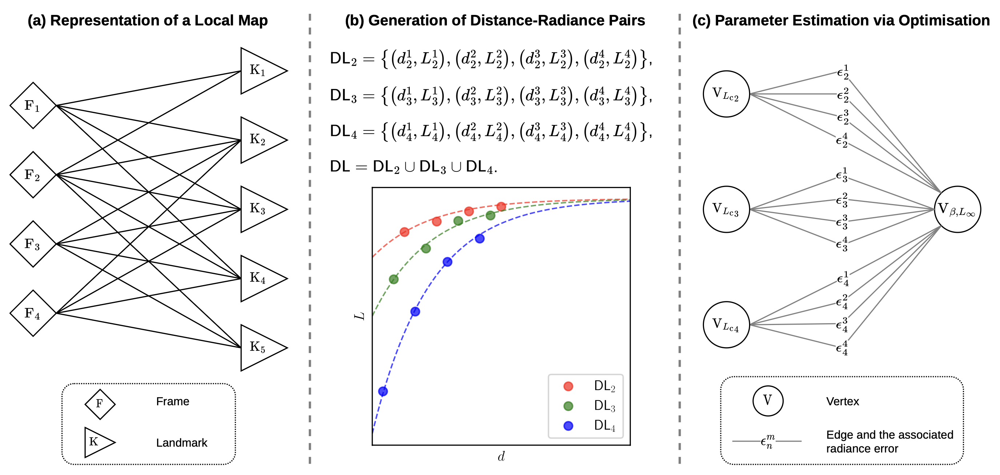

# Estimating Fog Parameters from a Sequence of Stereo Images
This repository provides the implementation of our method for estimating and dynamically updating the parameters of the atmospheric scattering model from a sequence of stereo foggy images.

This work has been accepted by IEEE Transactions on Pattern Analysis and Machine Intelligence (TPAMI) in 2025.

Paper link [Coming soon]

<!-- []()
[]() -->

## Overview of our three-step method

1. Representation of a local map as a bipartite graph that describes which frames observe which landmarks
2. Generation of distance-radiance pairs, where distance is computed using the camera's pose and the landmark's 3D position, and radiance is computed by applying gamma expansion to the intensity value of the landmark's corresponding 2D feature point in the frame
3. Parameter estimation via optimisation, whose problem is represented as a hypergraph, where a vertex represents an optimisation variable (or a group of variables), and an edge  
represents an observation error.

Note that these figures are *illustrative*.
In reality, a local map typically contains many more landmarks, with each landmark being observed in many more frames.
The graphs are thus much larger in practice.

# The Stereo Driving In Real Fog (SDIRF) dataset
As part of this research, we collected the Stereo Driving in Real Fog (SDIRF) dataset, which was extensively used in our experiments and evaluation.

SDIRF contains high-quality, consecutive stereo frames of real-world foggy driving scenes captured under a wide range of visibility conditions.
With the following features, SDIRF is a first-of-its-kind dataset.
- 52 foggy sequences in total: 32 thick fog, 20 thin fog
- Over 40 minutes of footage (>34,000 frames)
- Includes camera photometric parameters calibrated in a controlled lab environment, which are essential for accurate application of the atmospheric scattering model
- Also includes clear-weather counterparts of the same routes recorded under overcast conditions, providing valuable data for companion work in image defogging and depth reconstruction.

Dataset link: [Coming soon]

<!-- []() -->


<!-- # Citing our work
If you find our code or dataset useful, please consider citing our work.
```BibTex
@article{ding2025estimating,
  author={Ding, Yining and Mota, João F. C. and Wallace, Andrew M. and Wang, Sen},
  journal={IEEE Transactions on Pattern Analysis and Machine Intelligence}, 
  title={Estimating Fog Parameters from a Sequence of Stereo Images}, 
  year={2025},
  volume={},
  number={},
  pages={},
  keywords={},
  doi={}
  }
``` -->

# 0. Prerequisites
Our code is built upon [ORB-SLAM2](https://github.com/raulmur/ORB_SLAM2).
- We use the stereo ORB-SLAM2 to facilitate multiple observations of the same landmark from a range of known distances.
Please follow [their instructions](https://github.com/raulmur/ORB_SLAM2?tab=readme-ov-file#2-prerequisites) to install the required dependencies.
- We use the [Ceres Solver](http://ceres-solver.org/) (2.1.0) to solve the optimisation problem for estimating the fog parameters.
Please follow [their instructions](http://ceres-solver.org/installation.html) for installation.

# 1. Building ORB-SLAM2 library and our examples
After installing the dependencies, make sure you are in the root directory of this project and execute:
```
chmod +x build.sh
./build.sh
```
This will create **libORB_SLAM2.so** in *lib* folder and the following two executables in *Examples/Stereo* folder.
- **stereo_vkitti2**
- **stereo_sdirf**

# 2. Preparing data
We illustrate how to prepare synthetic foggy images (see Section V-A of our paper) and real foggy images for evaluation, using VKITTI2 and SDIRF, respectively, as examples.

## VKITTI2
We provide a sample foggy sequence of VKITTI2 that you can [download]() for quick testing.
Download and unzip this file, and place the resulting folder to `YourFoggyVKITTI2Folder`.
Assume the folder structure is as follows:
```
YourFoggyVKITTI2Folder
  └── R00_FogThin
```

## SDIRF
Download and unzip files of foggy sequences of SDIRF, and place the resulting folders to `YourSDIRFFolder`.
Assume the folder structure is as follows:
```
YourSDIRFFolder
  ├── P00_FogThick
  ├── ...
  ├── P24_FogThin
  ├── Q00_FogThick
  ├── ...
  ├── Q25_FogThick
  └── R00_FogThin  
```

# 3. Running the examples
## VKITTI2
Execute the following command to run on this foggy sequence of VKITTI2.
```
./Examples/Stereo/stereo_vkitti2 ./Vocabulary/ORBvoc.txt ./Examples/Stereo/VKITTI2.yaml YourFoggyVKITTI2Folder/P11_FogThin/images_colour/
```
The arguments follow the same convention as in ORB-SLAM2.

## SDIRF
As an example, execute the following command to run on the `P00_FogThick` sequence of SDIRF.
```
./Examples/Stereo/stereo_sdirf ./Vocabulary/ORBvoc.txt ./Examples/Stereo/SDIRF.yaml YourSDIRFFolder/P00_FogThick/images_colour/ G5E10
```
The first three arguments follow the same convention as in ORB-SLAM2.
The very last argument is the combination of gain and exposure of the corresponding SDIRF sequence, which can be obtained from Table III in the supplementary material.

# 4. Interpreting the results
Estimation results will be appended to txt files in the *results* folder on-the-fly.
There are three (or four if running a SDIRF sequence) of them:

| File name | Method                                                       |
| --------- |--------------------------------------------------------------|
| `OthersLi-AModeMax-PreservePositiveBetaFalse.txt` | Li's method                                                  |
| `OthersLi-AModeMedian-PreservePositiveBetaTrue.txt` | Li's modified method                                         |
| `Ours-Stage2-Weightproductthenuniform-IntensityModeraw-Optimiserceres_tight.txt` | Our method                                                   |
| `Ours-Stage2-Weightproductthenuniform-IntensityModeraw-Optimiserceres_tight-WoGc.txt` | Our method without gamma correction, i.e., using intensity (only generated if running a SDIRF sequence) |

In each file, each row corresponds to an update of the fog parameters.

For Li's method and Li's modified method, each row has 18 entries.
- Column 0: Frame index
- Column 1: Keyframe index (from ORB-SLAM2)
- Columns 2 - 5: **blue** colour channel: $\hat{\beta}$, $\hat{L}_\infty$, number of valid estimates of beta to build its histogram, total number of estimates of beta (for example, if there are 2 landmarks, one observed by 5 frames and the other by 4 frames, then the total number of estimates of beta is 5-choose-2 + 4-choose-2 = 10 + 6 = 16)
- Columns 6 - 9: **green** colour channel: same as above
- Columns 10 - 13: **red** colour channel: same as above
- Columns 14 - 17: **grayscale**: same as above

For our method, each row has 22 entries.
- Column 0: Frame index
- Column 1: Keyframe index (from ORB-SLAM2)
- Columns 2 - 6: **blue** colour channel: $\hat{\beta}$, $\hat{L}_\infty$ (or $\hat{A}$ when using intensity), number of landmarks (in the 2nd optimisation stage), number of observations (in the 2nd optimisation stage), number of iterations to converge (in the 2nd optimisation stage)
- Columns 7 - 11: **green** colour channel: same as above 
- Columns 12 - 16: **red** colour channel: same as above 
- Columns 17 - 21: **grayscale**: same as above

# 5. Visualising the results
The Python script `visualisation/plot_beta_vs_frame_sdirf.py` is provided to visualise the results by plotting $\hat{\beta}$ against frame.
Make sure you have installed the required Python packages: `pandas` and `matplotlib`.

For example, executing the following command on the result files generated by running the executable on the sequence `P11_FogThin` should create `./visualisation/beta_vs_frame_P11_FigThin.pdf`, which should reproduce (may not exactly because ORB-SLAM2 is multi-threaded and each run can generate slightly differnt key frames and landmarks) Fig. 12(b) in the paper.
```python
python3 ./visualisation/plot_beta_vs_frame_sdirf.py --result_path ./results --sequence P11_FogThin --output_path ./visualisation
```

# Open-sourced code we used to compare our method with
## [Non-local Image Dehazing](https://openaccess.thecvf.com/content_cvpr_2016/papers/Berman_Non-Local_Image_Dehazing_CVPR_2016_paper.pdf)
We adapted this [implementation]((https://github.com/danaberman/non-local-dehazing)) to radiance images and used it to generate the atmospheric light estimates reported under the caption “Berman’s” in Fig. 13 of the paper.

## [Single Image Haze Removal Using Dark Channel Prior](http://ieeexplore.ieee.org/document/5206515/)
We adapted this [implementation](https://github.com/sakaridis/fog_simulation-SFSU_synthetic/tree/master/source/Dehazing/Dark_channel_prior) to radiance images and used it to generate the atmospheric light estimates reported under the captions “Li’s” and “Li’s mod” in Fig. 13 of the paper.
We also used it to generate the defogged images in the top four rows of Fig. 14 of the paper with known corresponding atmospheric light that is shown in Fig. 13.

We thank them for making their code open source.

# To-Dos
- [ ] Add code
- [ ] Add paper links
- [ ] Add SDIRF link
- [ ] Add citation section

# License
This project is released under the MIT License.

See the [LICENSE](/LICENSE) file for details.
